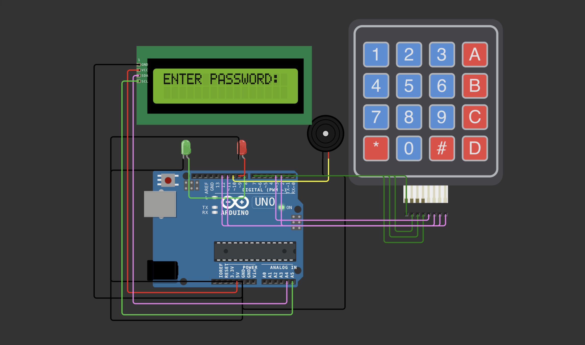

# Smart Keypad Security System (Arduino/C++)

A robust digital security lock system built using C++ and Arduino. This system features an I2C LCD for user feedback, a 4x4 matrix keypad for input, and visual/audio indicators for access control.

# System Simulation

# 🛠️ Components Used
- **Microcontroller:** Arduino Uno (or ESP8266/ESP32)
- **Input:** 4x4 Matrix Keypad
- **Output:** 16x2 LCD with I2C Module
- **Indicators:** Green LED (Success), Red LED (Failure), Active Buzzer (Alarm)

# ⚙️ How It Works
1. **User Input:** The system prompts the user to enter a 4-digit password.
2. **Masking:** For privacy, the LCD displays `*` characters instead of the actual numbers.
3. **Validation:** - Pressing `#` validates the entry.
   - Pressing `*` clears the current input.
4. **Action:** If the password matches `1234`, the Green LED triggers. Otherwise, the Red LED and Buzzer trigger a 2-second alert.

# 🔌 Connection Diagram
| Component | Pin | 
| :--- () :--- |
| LCD SCL/SDA -> A5 / A4 (or dedicated I2C pins) |
| Keypad Rows -> ( 7, 6, 5, 4 ) |
| Keypad Cols -> (3, 2, 12, 11) |
| Green LED -> 8 |
| Red LED -> 9 |
| Buzzer -> 10 |

## 💻 Code Highlights
The project utilizes the `Keypad.h` and `LiquidCrystal_I2C.h` libraries to handle hardware interrupts and communication. It implements **State Reset** logic to ensure the system returns to a secure state after every attempt.
